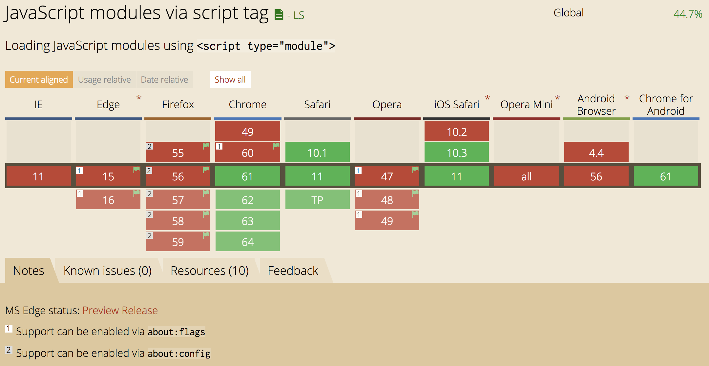
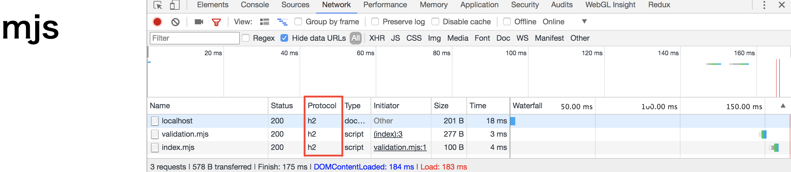

---

## .mjs + HTTP/2 = Universal JS

2017/10/06 @Gotanda.js #9

---

## darai0512


- Work: Hadoop (java/python), API (Node.js)
- Like: [codegolf](https://darai0512.github.io/talks/node_school_20170424/), 勉強会

---

### Question

本題に入る前の肩慣らしに

```
$ node -p  '{a: 1}'
の出力が 1 である理由を Node と JavaScript の仕様を踏まえて答えてください。
```

---

### Answer

```
$node --help |grep '\-\-print'
  -p, --print                evaluate script and print result
$ node -p "{}"
undefined
$node -p "{a:1,b:2}"
[eval]:1
{a:1,b:2}
      ^

SyntaxError: Unexpected token :
$ node -p "{a:1;b:2}"
2
```

- ブラケットはblock scopeとして
- `a:`はlabelとして

評価されるため、結果は1となる

Ref. [Ecma Spec](http://www.ecma-international.org/ecma-262/6.0/)

---

##  What’s .mjs?

- ES ModulesをNode.jsで扱うための新拡張子
  - Node.jsは`require()`などの[Modules API](https://nodejs.org/dist/latest-v8.x/docs/api/modules.html)を捨てる
  - `import/export`構文に統一
  - flaggedで実行可能(>= v8.5)

```
node --experimental-modules hoge.mjs
```

- ブラウザではscriptタグ内で`type=module`で扱える
  - [flagged/unflaggedで実行可能](http://caniuse.com/#feat=es6-module)

---

### ブラウザ実装状況



---

### before

```
<!-- browser
<script type=text/javascript src='bundle.js'></script>
-->

// server
const pkg = require('pkg');
module.exports = {pkg};
```

---

### after

```
<!-- browser
<script type=module src='not_bundle.js'></script>
-->

// server
import hoge from './hoge';
export default hoge;
```

---

### Diff (Node.js)

- [Modules API](https://nodejs.org/dist/latest-v8.x/docs/api/modules.html)が消える
- そこから生えてたGlobal変数等も消える
  - `module`
  - `require.cache`
  - `__dirname`
  - `NODE_PATH`
  - etc...

---

### Diff (ECMAScript)

- not Function but Syntax
  - 静的解析がしやすくなる
  - 動的ロードはできなくなる
- not PATH but URL (Node.jsでは`file://`)
- strict mode
- スコープが区切られる
- `this`は`undefined`

---

### 動的ロードェ...

```
const myPkg = env === 'development' ? require('../mypkg') : require('mypkg');
```

- 自分はNode.jsで環境によってpkg or directoryと読み込み方変えてた
- せめて`$NODE_PATH`が使えれば(´・ω・｀)
- 互換目的の`import()`([Dynamic Import](https://github.com/tc39/proposal-dynamic-import))で代用可能？
  - 但しPromiseが返るので自分で制御

---

### 移行大変そう。でもこの一歩は、


---

## Load to Universal JS

- ブラウザでも.mjsで読み込もう
  - `<script type=module src="./foo.mjs">`
- 但し`X-Content-Type-Options: nosniff`なので`Content-Type`をjsとして明示
  - Webサーバーによっては`Content-Type: application/javascript`で送ってくれない
    - 自分の環境ではapacheはダメだったけどexpressでは明示せずとも渡せた
  - [`application/octet-stream`](http://wa3.i-3-i.info/word15821.html)は`nosniff`だからダメ

---

### Try Universal JS

```
$cat validation.mjs
export default (input) => typeof input === 'string';

<!-- on browser
<script type=module>
import validation from './validation.mjs';
if (validation('user-input')) console.log('ok'); // ok
</script>
-->

$cat serverside.mjs && node --experimental-modules serverside.mjs
import validation from './validation';
if (validation('user-input from browser')) console.log('ok');
(node:72314) ExperimentalWarning: The ESM module loader is experimental.
ok
```

- validationをブラウザ・サーバー共通で使う例
- importする側もES Modulesである必要がある
- ブラウザ側は拡張子まで含む必要があることに注意

---

### Try Universal JS (using npm package)

```
$cat validation.mjs
import validation from './node_modules/myValidation/index.mjs';
export default (input) => validation(input);
```

- validationの中でnpm packageを使う場合の例
- nodeでは`from 'myValidation'`の指定で十分
- だがブラウザ側は拡張子まで必要
- なので現状だと上記のような工夫が必要......

---

## [HTTP/2](https://tools.ietf.org/html/rfc7540)

- not Text but Binary
  - 1本のTCP接続の内部に仮想のTCPソケットを作成
  - 並列接続でもハンドシェイク不要
  - cf. HTTP/1.1では1 reqがsocketを占有した状態で並列接続(ex, Chrome:6本)
- Hpack
  - headerの圧縮([頻出headerのkey/val](https://tools.ietf.org/html/rfc7541#appendix-A)を保持)
- Server Push
  - CSS/JS/画像を事前に送りブラウザのキャッシュに入れておける
  - 表示ページのassetだけでなく今後遷移するページのもPUSH可能(広告歓喜！)

---

### Performance

- js/css/画像はなるべく少ないファイル数にすべき?
  - それはHTTP1のTipsで、HTTP2では並列ロードにお任せしてESMで結合がベスト?
  - でもbundleしたfileの方が総合的な通信量は減る
  - でも分割した方が変更時のキャッシュヒット率が上がる
- 現実 (by 大津さん,ahomuさん @html5conf)
  - [DOMContentLoadedは変化無し](https://www.slideshare.net/techblogyahoo/web-html5j-html5jb/36)
  - [導入だけで早くなった感じはない](https://html5experts.jp/shumpei-shiraishi/24156/)
  - [TLSハンドシェイク数が減ったのでサーバーサイドのCPU負荷は減った](https://html5experts.jp/shumpei-shiraishi/24164/)

---

### HTTP/2 対応状況

- [website全体の17.5%](https://w3techs.com/technologies/details/ce-http2/all/all)
- Nginx/Apache/Node.js(>= v8.4 (flagged))などで利用可能
  - Nodeの実装はtatsuhiro_tさんの[nghttp2](https://github.com/nghttp2/nghttp2)ベース
  - ちなみに[Node.jsのweb serverは全体の0.3%](https://w3techs.com/technologies/overview/web_server/all)

---

### Try HTTP/2 with express

1. 鍵作成
  - 主要ブラウザにおいてHTTP/2はTLS前提
  - 但しlocalhostはブラウザが特別扱いしてくれてTLS不要
  - のはずがダメだった(ServiceWorkerでは不要だったのに)
1. `http2` module
  - `stream`イベントを利用するのが王道だが`http/https` Compatibility APIを利用
  - 従来通り`createServer()`に`express()`を渡す
1. 実行
  - with `--expose-http2` flag

---

### Try HTTP/2 with express: 鍵作成

オレオレ証明書を作成

```
$brew upgrade openssl  # macデフォのだとversionが古くてできない
$openssl version
OpenSSL 1.0.2l  25 May 2017

$openssl genrsa -aes128 -out my.key 2048  # AES-128. DES、3DES、SEEDは非推奨
$openssl req -new -key my.key -out my.csr  # 対話では全てdefaultを回答
$openssl x509 -req -days 365 -in my.csr -signkey my.key -out my.cert
```

---

### Try HTTP/2 with express: http2 module

```
$cat server.js
const express = require('express');
const http2 = require('http2');
const fs = require('fs');
const options = {
  key: fs.readFileSync(__dirname + '/my.key'),
  cert: fs.readFileSync(__dirname + '/my.cert')
};
const app = express();
app.use(express.static(__dirname + '/views'));
app.use(express.static(__dirname + '/mjs', {
  setHeaders: (res, path, stat) => {
    res.header('Content-Type', 'application/javascript');
  }
}));

http2.createSecureServer(options, app).listen(8080);
```

---

### Try HTTP/2 with express: 実行

```
$npm install express
$cat views/index.html
<h1>mjs</h1>
<script type=module src=./validation.mjs> <!-- mjs試すなら用意 -->

$node --expose-http2 server.js
(node:73026) ExperimentalWarning: The http2 module is an experimental API.
```

listenできた! `https://localhost:8080/`を開くと......

```
_http_incoming.js:104
  if (this.socket.readable)
                 ^

TypeError: Cannot read property 'readable' of undefined
    at IncomingMessage._read (_http_incoming.js:104:18)
    at IncomingMessage.Readable.read (_stream_readable.js:445:10)
    at IncomingMessage.read (_http_incoming.js:96:15)
    at resume_ (_stream_readable.js:825:12)
    at _combinedTickCallback (internal/process/next_tick.js:138:11)
    at process._tickCallback (internal/process/next_tick.js:180:9)
```

---

### 対処法

- https://github.com/nodejs/node/issues/14672
  - まだexpressの内部実装が対応できてない様子
- https://github.com/expressjs/express/pull/3390
  - PRは出てるが、mergeされてない
  - 実装は悪くなさそうなのでphouriさんのを使ってみる

---

### Try HTTP/2 with express: 実行(revenge)

```
$git clone https://github.com/phouri/express.git -b initial-support-http2
$cat server.js
const express = require('./express'); // <- line.1を左記に変更
$node --expose-http2 server.js
```

`https://localhost:8080/`を開くと......h2通信できた!



---

## まとめ

- ES Modulesが来る！
  - 移行大変そうだけど、Universal JSへの大事な一歩
- HTTP/2が来た！！
  - 分割してもロードは早くなる（見込）
- Universal JSが、来る！！！

---

## References

- .mjs
  - [blog.jxck.io](https://blog.jxck.io/entries/2017-08-15/universal-mjs-ecosystem.html)
  - [teppeis blog](http://teppeis.hatenablog.com/entry/2017/08/es-modules-in-nodejs)
- HTTP/2
  - [masakielastic](https://qiita.com/masakielastic/items/83c440b52374f5addbd8)
  - [Ayumu Sato](https://speakerdeck.com/ahomu/zui-jin-false-web-pahuomansugai-shan-nituitezhi-tuteokitaikoto?slide=42)
