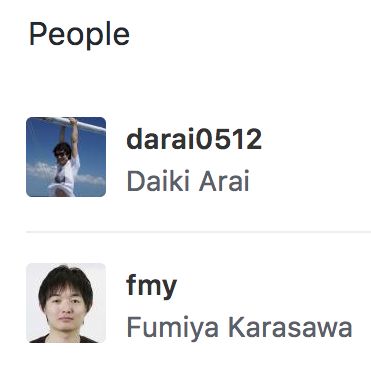
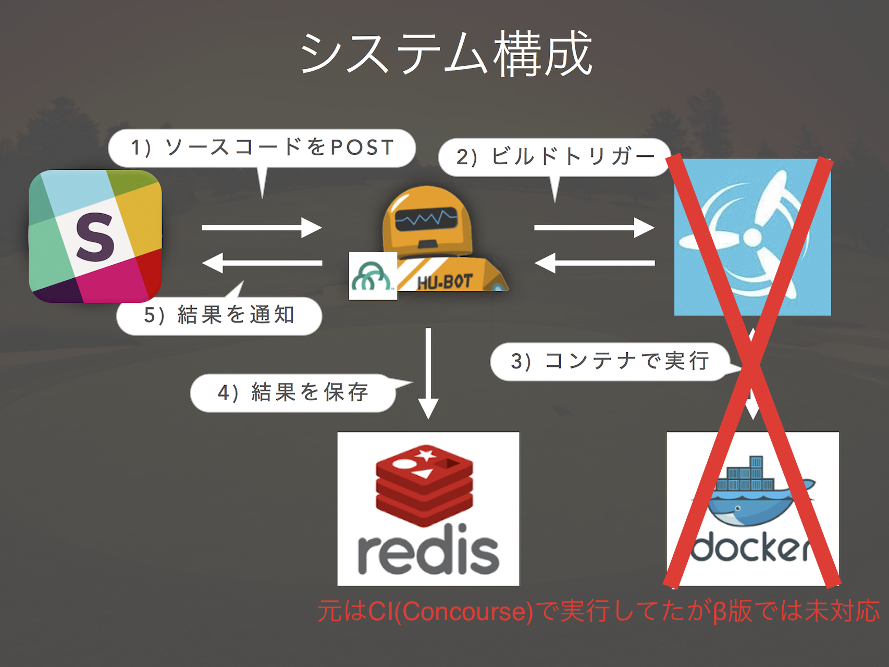

## Slack CodeGolf

参加方法: https://goo.gl/forms/OONuFtwtESP2kI5G2

2017/04 @darai0512


---

### darai0512

- Qiita/GitHub
- Nodejs: 1年半前のNode Schoolから
- PR: [10986](https://github.com/nodejs/node/pull/10986), [11646](https://github.com/nodejs/node/pull/11646), [11646](https://github.com/nodejs/node/pull/11646)


---

## CodeGolf

- 元々は@fmyが社内のコミュニケーションツール上で独自開発し開催
  - 数百人が白熱
- 自分がSlack APIに置き換えて公開してみた



---

## Demo

---

## 特徴

general channelには解答者のコードは公開されず

バイト数&順位のみ表示

- dockerコンテナは都度捨てられるので運営側も(基本的には)見れない
- (∗´꒳`)ﾄﾞﾔｧできる

---



---

## 禁止事項

- 答えをcatする行為
  - script内でちょくちょく権限操作
- ネットワーク遮断
```
ifconfig $(ifconfig | fgrep encap:Ethernet | awk '{print $1}') down
```
- bash以外のすべての言語で外部コマンド禁止
  - straceを用いて子ps監視
```
strace -f -e execve $COMMAND < ${INPUT}/$file
```

---

## Join URL

https://goo.gl/forms/OONuFtwtESP2kI5G2

- 注意
  - β版なので途中でランキングを削除予定
- herokuミスった
  - app内でdockerコマンドが使えるわけじゃなかった
  - sudo不可なため色々防げてない
- 参加者が増えたらサーバー借りて対応します

---

## ex1: ascii

次の文字列を出力してください。

```
!"#$%&'()*+,-./0123456789:;<=>?@ABCDEFGHIJKLMNOPQRSTUVWXYZ[\]^_`abcdefghijklmnopqrstuvwxyz{|}~
```

---

## by JavaScript

63 Byte
```
j=''
for(i=33;i<127;)j+=String.fromCharCode(i++)
console.log(j)
```

---

## by Nodejs

Node core APIではBufferを扱える

51 Byte (43 Byteまで縮められます)
```
console.log(Buffer.alloc(94,33).map((v,i)=>v+i)+"")
```


---

## Hint

標準入力を求められる問題において

Nodejsなら下記のように縮められます

```
// 文字コードを指定すればstring
s=require('fs').readFileSync('/dev/stdin','UTF8');

// 文字コードを指定しなければBuffer
b=require('fs').readFileSync('/dev/stdin');

// 引数はfdも可能、bufferはmap処理できる
require('fs').readFileSync(0).map(v=>{});

// eventで受けてもいい(bはBuffer)
process.stdin.on('data',b=>{});
```

---

# Welcome & Enjoy !!!

https://goo.gl/forms/OONuFtwtESP2kI5G2
